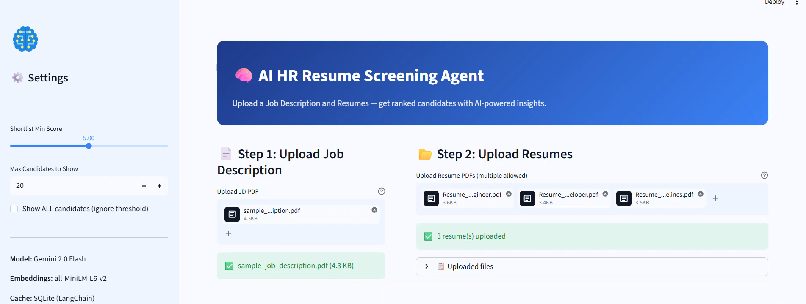
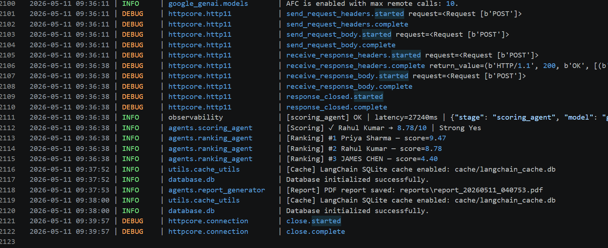
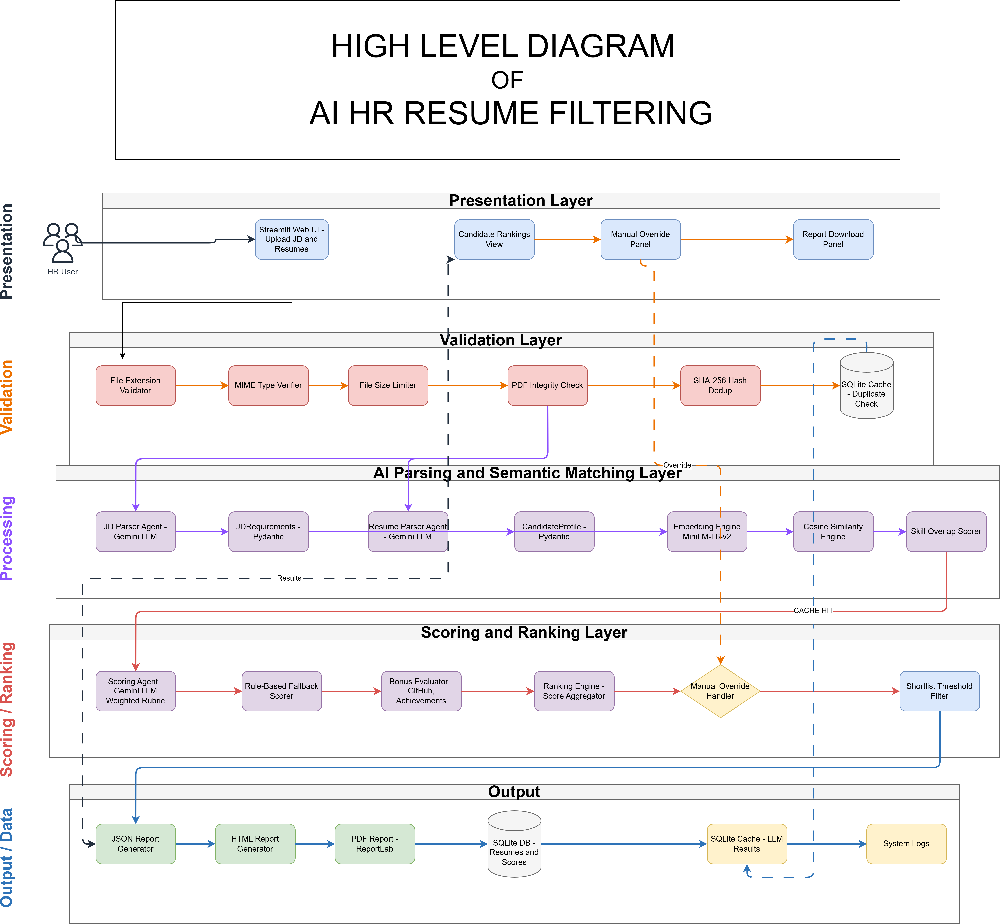

# 🧠 AI HR Resume Screening Agent

> Production-grade AI-powered HR screening system that intelligently parses, evaluates, ranks, and shortlists resumes using Gemini 2.0 Flash, semantic embeddings, and a modular multi-agent architecture.


---

## 🎥 Live Workflow Demo

👉 Full working demo video will be added after deployment.

[▶️ Watch Demo (Coming Soon)](#)

📌 The video will showcase:
- Resume upload
- JD parsing
- AI scoring engine
- Candidate ranking dashboard
- HR override system
- Final report generation

# 📸 Application Screenshots

## Upload Interface


## Ranked Candidate Dashboard


## 📄 Generated Reports

The system automatically generates a final HR report after processing resumes.

This includes:
- Ranked candidate list
- Weighted scoring breakdown
- Decision
-  Explainable AI: Candidate Ranking Rationale

👉 [Download Full Report](assets/Final_Report.pdf)
---
## 📡 System Observability & Execution Logs

To ensure transparency and traceability across the AI pipeline, the system generates structured logs for every processing stage including PDF parsing, LLM inference, semantic matching, and scoring.

These logs provide visibility into model behavior, latency, and intermediate outputs, enabling effective debugging and system monitoring.

### 📸 Sample Log Output



> The above log demonstrates real-time execution of the multi-agent pipeline, including document parsing (Docling), resume analysis (Gemini), semantic similarity computation, and final scoring workflow.

# ❓ Why This Project?

Traditional resume screening is:
- Time-consuming
- Difficult to scale
- Inconsistent across recruiters
- Vulnerable to manual bias

This project demonstrates how modern AI systems can automate candidate evaluation using:
- Multi-agent LLM pipelines
- Semantic similarity matching
- Structured scoring rubrics
- Secure validation layers
- Human-in-the-loop decision systems

The goal is to simulate a production-style AI hiring assistant with observability, security, modularity, and explainability.

---

# ✨ Features

- 📄 AI-powered resume parsing
- 🧠 Multi-agent architecture
- 📊 Weighted candidate scoring rubric
- 🔍 Semantic similarity matching
- ⚡ Gemini 2.0 Flash integration
- 🛡️ Prompt injection mitigation
- 📦 SHA-256 duplicate resume detection
- 🧾 Structured Pydantic validation
- 🗃️ SQLite persistence layer
- 📈 Candidate ranking engine
- 👨‍💼 HR manual override workflow
- 📑 PDF / HTML / JSON report generation
- 📡 Structured logging & observability
- 💾 LangChain SQLite caching
- 🚀 Streamlit deployment ready

---

# 🏗️ High-Level Architecture



---

# ⚙️ System Workflow

1. HR uploads a Job Description PDF
2. Multiple resumes are uploaded
3. Validation layer checks:
   - MIME type
   - File size
   - PDF integrity
   - Duplicate detection
4. Gemini parsing agents extract structured data
5. Semantic engine computes similarity scores
6. Weighted rubric scoring is applied
7. Candidates are ranked automatically
8. HR can manually override candidate scores
9. Reports are generated in PDF/HTML/JSON format

---

# 🧠 Engineering Highlights

- Multi-agent AI orchestration
- Semantic embeddings with sentence-transformers
- Structured LLM outputs using Pydantic
- Graceful fallback scoring on LLM failure
- Human-in-the-loop override system
- SQLite-backed caching and observability
- Prompt injection defense mechanisms
- Production-style modular architecture
- Secure API key handling
- Duplicate processing prevention using SHA-256 hashing

---

# 📁 Project Structure

```bash
hr_resume_agent/
│
├── assets/
│   ├── hr_resume_screening_workflow.mp4
│   ├── Final_Report.pdf
│   ├── HLD.png
│   ├── human_redable_log_file.png
│   ├── candidate_ranking_dashboard01.png
│   ├── candidate_ranking_dashboard02.png
│   └── UI.png    
│
├── app.py
├── requirements.txt
├── .env.example
├── .gitignore
│
├── agents/
│   ├── jd_parser.py
│   ├── resume_parser.py
│   ├── scoring_agent.py
│   ├── ranking_agent.py
│   └── report_generator.py
│
├── embeddings/
│   └── similarity_engine.py
│
├── database/
│   └── db.py
│
├── utils/
│   ├── pdf_utils.py
│   ├── hashing.py
│   ├── validation.py
│   ├── logging_utils.py
│   └── cache_utils.py
│
├── prompts/
│   ├── jd_prompt.txt
│   ├── resume_prompt.txt
│   ├── scoring_prompt.txt
│   └── report_prompt.txt
│
├── schemas/
│   └── pydantic_models.py
│
├── data/
├── uploads/
├── logs/
└── cache/
```

---

# 🧰 Tech Stack

| Component | Technology | Purpose |
|---|---|---|
| UI | Streamlit | Rapid AI application development |
| LLM | Gemini 2.0 Flash | Fast and cost-efficient reasoning |
| Framework | LangChain | Prompt orchestration and caching |
| Embeddings | sentence-transformers MiniLM-L6-v2 | Semantic similarity matching |
| Validation | Pydantic v2 | Structured output validation |
| PDF Parsing | Docling | Reliable PDF text extraction |
| Database | SQLite | Lightweight persistence layer |
| Cache | LangChain SQLiteCache | Prevent redundant API calls |
| Reports | ReportLab + HTML | Professional report generation |
| Logging | Python logging + SQLite | Observability and monitoring |

---

# 📋 Technical Stack & Decision Log

| Component | Choice | Why This Choice? |
|---|---|---|
| LLM | Gemini 2.0 Flash | Fast inference, low latency, cost-effective |
| Agent Framework | LangChain | Strong ecosystem and modular orchestration |
| Embeddings | MiniLM-L6-v2 | Lightweight and accurate local embeddings |
| Validation | Pydantic v2 | Reliable schema enforcement for LLM outputs |
| Database | SQLite | Zero-config local persistence |
| UI | Streamlit | Fast prototyping without frontend complexity |
PDF Parsing | Docling | Extracts clean structured data from complex and scanned PDFs using OCR and layout-aware parsing.
| Caching | LangChain SQLiteCache | Reduces unnecessary LLM API calls |

---

# 🤖 Agent Architecture

The system uses a modular multi-agent pipeline:

| Agent | Responsibility |
|---|---|
| JD Parser Agent | Extracts structured hiring requirements |
| Resume Parser Agent | Extracts candidate profile data |
| Semantic Matching Engine | Computes embedding similarity |
| Scoring Agent | Applies weighted evaluation rubric |
| Ranking Agent | Produces ranked candidate list |
| Report Generator Agent | Generates PDF/HTML/JSON reports |

Each component operates independently while exchanging validated structured outputs.

---

# 📊 Scoring Rubric

| Dimension | Weight | Description |
|---|---|---|
| Skills Match | 30% | Required + preferred skill overlap |
| Experience Relevance | 25% | Years of experience and domain fit |
| Project Relevance | 20% | Technical complexity and impact |
| Education & Certifications | 15% | Academic background and certifications |
| Communication Quality | 10% | Resume clarity and structure |

### Confidence Bonuses (Max +0.5)

- +0.2 for GitHub profile/projects
- +0.2 for quantified achievements
- +0.1 for relevant certifications

---

# 🧾 Prompt Engineering Strategy

Prompts were designed using:
- Strict role-based instructions
- JSON-only response formatting
- Context isolation
- Anti-prompt-injection guidance
- Structured schema enforcement

### Guardrails

- Pydantic validation
- Retry handling
- Sanitized resume text
- Fallback heuristic scoring
- Confidence threshold checks

---

# 🔒 Security Risk Mitigation

## 🔐 Security Risk Mitigation

| Risk | Description | Mitigation Strategy |
|------|-------------|---------------------|
| Prompt Injection | Malicious inputs embedded inside resumes or PDFs attempting to manipulate agent behavior or override system instructions | The system mitigates prompt injection by applying strict input sanitization during the PDF parsing stage using Docling-based extraction. Since resumes may contain hidden(Like we CANT IDENTIFY with out EYES if that malicious prompt and BACKGROUND COLOR of resume are SAME) or embedded malicious instructions, the extracted text is cleaned and filtered before being passed to the LLM. This ensures that any injected prompts inside PDF content are neutralized during preprocessing. Additionally, strict prompt separation and structured output validation using schemas further prevent execution of unintended instructions. |
| Data Privacy / PII | Resumes may contain sensitive personal data such as email addresses, phone numbers, and identity details | No raw PII is stored in the database. The system uses SHA-256 hashing for file identification and stores only metadata such as candidate ID, file hash, candidate name, total score, structured score JSON, JD hash, and timestamps in the `hr_db`. Additionally, LLM prompts and responses are stored separately in a `langchain_cache_db` for caching purposes, ensuring traceability without exposing sensitive user data. |
| API Key Exposure | Risk of leaking API credentials or secrets in source code or logs | Environment variables via `.env`, secured with `.gitignore`, and use of `python-dotenv` |
| Hallucination Risk | LLM may generate incorrect or fabricated scoring or interpretations | The system reduces reliance on a single LLM output by using a multi-layer scoring pipeline: (1) semantic similarity via cosine similarity engine, (2) weighted rubric matrix for deterministic scoring, (3) LLM-based evaluation for contextual reasoning, and (4) a fallback heuristic scoring mechanism in case of failures. Additionally, confidence is boosted when verifiable signals such as GitHub profile links are present, as they provide external validation of candidate credibility and reduce hallucination impact. All outputs are enforced through Pydantic schema validation and structured JSON generation to ensure consistency. |
| Unauthorized / Malicious File Access | Risk of uploading malicious files (e.g., disguised executables like .exe renamed as .pdf) to the processing pipeline | The system implements multi-layer file validation to prevent malicious uploads: (1) file extension validation to ensure only allowed formats are accepted, (2) MIME type verification to confirm actual file content type, (3) file size checks to reject empty or corrupted uploads, and (4) magic byte inspection (e.g., `%PDF` header validation) to ensure the file structure matches a genuine PDF. These layered checks collectively ensure that only valid and safe PDF documents enter the processing pipeline. |
| Duplicate Processing | Same resume uploaded multiple times leading to redundant computation | SHA-256 file hashing with SQLite-based deduplication before processing |

## ⚡ Performance Optimization & API Cost Reduction

The system is optimized to reduce unnecessary LLM API calls and improve overall processing efficiency through multiple pre-processing and caching strategies.

Before invoking any LLM-based agents, resumes are first pre-filtered using semantic similarity matching with Sentence Transformers. A cosine similarity-based comparison between job descriptions and resumes is performed to eliminate clearly irrelevant candidates early in the pipeline, significantly reducing downstream LLM usage.

Additionally, a caching mechanism is implemented to avoid redundant processing of previously evaluated resumes. If a resume (identified via file hash) has already been processed, stored results are reused instead of triggering repeated embeddings or LLM calls.

These optimizations ensure that only high-relevance candidates proceed to expensive LLM-based scoring, thereby reducing API cost, improving latency, and increasing system scalability.

## 📡 Observability & Execution Logs

The system implements structured logging across all pipeline stages to ensure full traceability, performance monitoring, and debugging capability in a production-like environment.

Each request is tracked with detailed metadata including stage-level execution status, latency metrics, model usage, semantic scores, and extracted candidate insights.

### 🔍 Example Pipeline Execution Trace

- 📄 PDF Extraction (Docling):  
  Successfully extracted structured text from resume with ~2076 characters in ~4.99s processing time.

- 🧠 Resume Parser Agent (Gemini):  
  Candidate processed using `gemini-2.5-flash` with ~11.1s latency, extracting ~30 skills and ~5.5 years experience.

- 📊 Semantic Matching Engine:  
  Cosine similarity score computed: **0.5210**, with skill overlap score: **0.07**

- ⚡ Embedding Layer:  
  Combined similarity pipeline executed with real-time scoring and logging.

- 📡 API Observability:  
  All LLM requests tracked with request/response metadata, latency, and structured JSON logging.

### 🧾 Logged Metadata Includes:
- Processing stage (parser, embeddings, scoring)
- Model name (e.g., gemini-2.5-flash)
- Latency per stage (ms)
- Skill extraction metrics
- Semantic similarity scores
- Error tracking (if any)
- File and candidate identifiers


This enables:
- Debugging
- Auditing
- Performance analysis
- Failure tracing

---

# 🗃️ Database Schema

```sql
CREATE TABLE file_hashes (
    file_hash TEXT PRIMARY KEY,
    filename  TEXT,
    added_at  TEXT DEFAULT (datetime('now'))
);

CREATE TABLE processed_resumes (
    id             INTEGER PRIMARY KEY AUTOINCREMENT,
    file_hash      TEXT UNIQUE NOT NULL,
    filename       TEXT,
    candidate_name TEXT,
    profile_json   TEXT,
    jd_hash        TEXT,
    processed_at   TEXT DEFAULT (datetime('now'))
);

CREATE TABLE candidate_scores (
    id             INTEGER PRIMARY KEY AUTOINCREMENT,
    file_hash      TEXT,
    candidate_name TEXT,
    total_score    REAL,
    score_json     TEXT,
    jd_hash        TEXT,
    scored_at      TEXT DEFAULT (datetime('now')),
    UNIQUE(file_hash, jd_hash)
);

CREATE TABLE overrides (
    id             INTEGER PRIMARY KEY AUTOINCREMENT,
    file_hash      TEXT,
    candidate_name TEXT,
    old_score      REAL,
    new_score      REAL,
    reason         TEXT,
    override_by    TEXT DEFAULT 'HR Manager',
    created_at     TEXT DEFAULT (datetime('now'))
);

CREATE TABLE processing_logs (
    id         INTEGER PRIMARY KEY AUTOINCREMENT,
    stage      TEXT,
    model_name TEXT,
    latency_ms REAL,
    token_usage TEXT,
    error      TEXT,
    extra      TEXT,
    logged_at  TEXT DEFAULT (datetime('now'))
);
```

---

# 🚀 Quick Start

## 1️⃣ Clone Repository

```bash
git clone https://github.com/yourusername/hr-resume-agent.git

cd hr-resume-agent
```

---

## 2️⃣ Create Virtual Environment

```bash
python -m venv venv
```

### Windows

```bash
venv\Scripts\activate
```

### Linux / Mac

```bash
source venv/bin/activate
```

---

## 3️⃣ Install Dependencies

```bash
pip install -r requirements.txt
```

---

## 4️⃣ Configure Environment Variables

Create `.env`

```env
GOOGLE_API_KEY=your_api_key_here
```

---

## 5️⃣ Run Application

```bash
streamlit run app.py
```

Open:

```text
http://localhost:8501
```

---

# ☁️ Deployment

## Streamlit Cloud

1. Push repository to GitHub
2. Open Streamlit Cloud
3. Connect GitHub repository
4. Add secrets:

```toml
GOOGLE_API_KEY="your_key_here"
```

5. Deploy application

---

# 🧪 Sample Output JSON

```json
{
  "generated_at": "2024-01-15T10:30:00",
  "job_title": "Senior ML Engineer",
  "total_candidates": 8,
  "candidates": [
    {
      "rank": 1,
      "name": "Priya Sharma",
      "effective_score": 8.7,
      "recommendation": "Strong Yes"
    }
  ]
}
```

---

## 🚧 Challenges Faced & Engineering Solutions

During the development of the AI Resume Screening system, several real-world engineering challenges were encountered and addressed to ensure robustness, security, and production readiness.

### 📄 Handling Malformed Resumes
Resumes often came in inconsistent formats (scanned PDFs, corrupted layouts, or unstructured text), making extraction unreliable. This was addressed using Docling-based parsing with fallback extraction logic to ensure consistent structured output.

### 🛡️ Preventing Prompt Injection Attacks
Resumes occasionally contained hidden or embedded instructions attempting to manipulate the LLM. A dedicated sanitization layer was implemented during preprocessing to remove or neutralize malicious content before reaching the model.

### ⚠️ Reducing LLM Hallucinations
To avoid unreliable AI-generated outputs, the system uses a hybrid scoring pipeline combining cosine similarity, weighted rubric scoring, and heuristic fallback logic, rather than relying solely on LLM responses.

### ⚡ Managing API Usage Efficiently
LLM API costs and latency were optimized using semantic pre-filtering (Sentence Transformers) and caching of previously processed resumes to avoid redundant calls.

### 📊 Designing Reliable Scoring Heuristics
A multi-factor weighted scoring system was designed (skills, experience, projects, education, communication) to ensure deterministic and explainable candidate evaluation.

### 🧾 Ensuring Structured LLM Outputs
All LLM responses are enforced through Pydantic schemas and strict JSON validation to guarantee consistent, machine-readable outputs across the pipeline.

---

## 📚 Key Learnings

This project provided hands-on experience in designing and building a production-style AI system with multiple interacting components. Key learnings include:

- Designing modular, agent-based AI systems where each component (parsing, scoring, ranking) operates independently yet contributes to a unified pipeline.

- Implementing multi-agent orchestration, where structured outputs are passed between agents in a controlled and sequential workflow.

- Applying structured LLM validation using Pydantic schemas to ensure consistent, reliable, and machine-readable AI outputs.

- Engineering semantic similarity systems using Sentence Transformers and cosine similarity for pre-LLM filtering and relevance detection.

- Building secure AI applications with protections against prompt injection, malicious inputs, and unsafe file uploads.

- Optimizing API usage and system performance through caching mechanisms, pre-filtering strategies, and elimination of redundant LLM calls.

- Implementing production-grade logging and observability to track pipeline execution, latency, model behavior, and debugging information across all stages.
---

## 🚀 Future Improvements & Scalability Roadmap

This system is designed as a scalable AI-powered HR platform, and several enhancements are planned to evolve it into a production-grade, enterprise-ready solution.

- **PostgreSQL Migration**  
  Upgrade from SQLite to PostgreSQL to support high concurrency, better query performance, and scalable multi-user environments.

- **Vector Database Integration**  
  Introduce a vector database (e.g., FAISS / Pinecone) to enable efficient semantic search across historical resumes and job descriptions.

- **RAG-powered Candidate Memory**  
  Implement Retrieval-Augmented Generation (RAG) to allow the system to learn from past candidate evaluations and improve contextual decision-making.

- **JWT Authentication & Authorization**  
  Add secure authentication using JWT to enable controlled access for recruiters and multi-tenant usage.

- **Recruiter Analytics Dashboard**  
  Build analytics for hiring trends, candidate distribution, skill gaps, and scoring patterns to support data-driven HR decisions.

- **Asynchronous Resume Processing**  
  Introduce async/background processing (Celery / FastAPI workers) to handle bulk resume uploads efficiently.

- **Kubernetes Deployment**  
  Containerize and deploy the system on Kubernetes for horizontal scaling, fault tolerance, and production-grade orchestration.

- **Role-Based Access Control (RBAC)**  
  Enable multi-user roles such as Admin, Recruiter, and Viewer to manage permissions across the platform securely.
---

# 🤝 Contributing

Contributions are welcome!

If you'd like to improve the project:

1. Fork the repository
2. Create a new feature branch
3. Commit your changes
4. Push the branch
5. Open a Pull Request

Please ensure:
- Code is properly documented
- Pydantic schemas remain validated
- Logs are structured
- Security checks are preserved


## ⭐ Acknowledgements

This project was made possible using several powerful open-source tools and AI frameworks that enabled fast development of a production-style multi-agent system:

- 🤖 Gemini API — Used for LLM-based parsing, reasoning, and structured candidate evaluation.
- 🧩 LangChain — Provided orchestration, caching, and prompt management for LLM workflows.
- 🔍 Sentence Transformers — Enabled semantic similarity computation for resume–JD matching.
- 🌐 Streamlit — Used to build the interactive user interface for resume upload and ranking visualization.
- 📄 Docling (IBM) — Used for robust PDF parsing and structured text extraction from complex documents.
- 📑 ReportLab — Used to generate professional, downloadable HR screening reports.

## 👨‍💻 Author

**Manohar Krishna**

B.Tech Student | AI/ML Enthusiast  
Focused on Multi-Agent Systems, LLM Engineering, and Backend AI Systems

Passionate about building production-style AI applications with emphasis on scalability, security, and real-world system design.